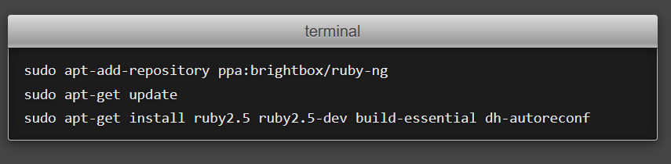

# 梦开始的地方

最近两天心血来潮，想要加入互联网大军，发扬互联网精神，那么起点就想从搭建个人网站开始。搭建网站有各种各样的选择，最**原始**的方法就是从0开始搭建自己的服务器，然后在服务器上部署网站，我估摸了一下大概要做以下事情（如有错误恳请指正）：

1. 有一台24小时不停机的服务器
2. 申请公网IP并获取域名
3. 在服务器上部署web服务器软件处理http请求，如apache、nginx
4. （Optional）动态网站还需要部署网关CGI，如php、flask、tomcat
5. 页面搭建与数据库构建
6. 安全性维护等

以上每一条~~看起来似乎都不难做到~~，但是要整体走完这个流程需要花费不少的功夫（尤其是安全性问题）。安全性问题和服务器的运维实在麻烦，如果不想处理此类问题可以租云服务器，如Azure、aws还有阿里云之类，~~但是要钱~~。

# Github Pages

最终我选择了最省心的方式（***save my life***），用Github提供的[pages服务](https://pages.github.com/)。借助pages可以把服务器的任务都交给github（**免费的**！），但是作为牺牲，要失去建立动态网页的能力，无法自定义服务器端的功能（如果实在想用pages建动态网页可以看[这个](https://link.zhihu.com/?target=https%3A//github.com/axetroy/blog)）。

原理大概就是你需要建立以 `username.github.io`为名称的仓库，然后启用仓库的pages服务，接着当用户访问 `https://username.github.io`时就会返回仓库中定义的网页。

比如你在仓库中创建index.html文件：

```bash
echo "Hello World" > index.html
```

你访问url就可以得到~~经典的~~hello world！

# 结束了？

不，才刚刚开始。~~不会真的有人想网站上就只有一串hello world吧。~~

其实，明白原理之后其实你可以手搓html/CSS/javascript，构建一个~~酷炫~~的网站。但是作为一个萌新，~~hello world已经是我的上限了~~，怎么可以不使用现成的网站生成框架来生成精美的网站呢？流行的框架有[hexo](https://hexo.io/index.html)，[jekyll](https://jekyllrb.com/)，而github pages官方推荐的框架就是jekyll，所以我理所应当地使用jekyll框架生成我的博客（~~绝对不是因为我很菜~~）。

## Ruby

由于jekyll是基于ruby的网站生成框架，因此想要使用就必须先安装ruby。你以为

```bash
sudo apt install ruby ruby-dev
```

就结束了？天真！虽然官方也是这么推荐的就是了

，但是你会发现apt安装的ruby会尝试在/var目录下安装插件，这需要root权限，而gem却无法通过sudo赋予权限进行安装。

```
You don't have write permissions for the /var/lib/gems/2.3.0 directory
```

此时正确的做法应该是安装rbenv，在用户态安装ruby，有点类似于nvm和node之间的关系，具体可以参考[StackOverflow](https://stackoverflow.com/questions/37720892/you-dont-have-write-permissions-for-the-var-lib-gems-2-3-0-directory)这篇文章。

> Tips：如果你向我一样有文件洁癖，不能容忍`$HOME`目录下一堆dotfiles，可以设置`RBENV_ROOT`为`$XDG_DATA_HOME`。

> 再给一个Tip：如果后序安装出问题可以试着`gem update`一下。

## Jekyll
ruby安装完之后jekyll的安装就非常简单了，
```
gem install bundler jekyll
```
然后跟着GitHub pages官方的文档就可以开心地写博客啦。

## 最后的提醒
本地测试博客没问题后，通过`git push`部署到github可能遇到和本地显示不一致的问题，原因很可能是`_config.yml`中配置的`baseurl`与实际部署位置不一致，注意两点：
1. 如果仓库为`username.github.io`，GitHub默认部署访问位置就是`https://username.github.io`。因此`baseurl`必须为空字符串
2. 如果仓库不是上述格式，而是其他名字，如`blogs`，则Github pages会部署到`https://username.github.io/blogs`，这就要求`baseurl`必须为`/blogs`。

---

免责声明：文章内容仅为经验体会，并非安装指南，请勿直接粘贴相关命令，请按官方文档进行安装
---

Refence
---
- https://pages.github.com/
- https://docs.github.com/en/pages/quickstart
- https://jekyllrb.com/
- https://stackoverflow.com/questions/37720892/you-dont-have-write-permissions-for-the-var-lib-gems-2-3-0-directory

THE END：Happy Blogging!
---